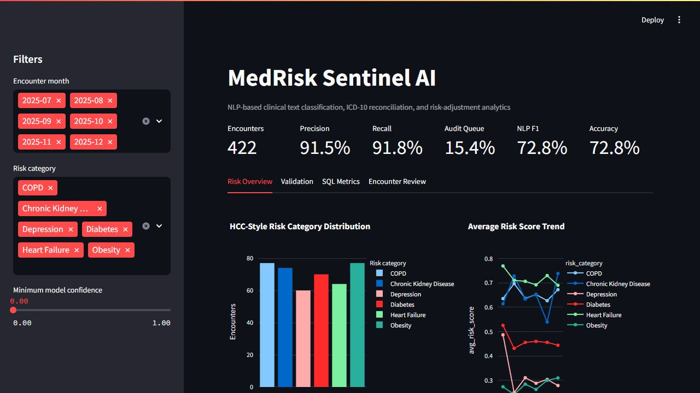

# MedRisk Sentinel AI

## NLP-Based Medical Text Classification & Risk Adjustment Analytics

MedRisk Sentinel AI is an end-to-end healthcare analytics project that simulates how a Risk Adjustment team can use NLP, SQL, and dashboarding to monitor medical coding quality, classify clinical text, and identify audit-priority encounters.

The project is built around a realistic healthcare analytics workflow involving ICD-10 code assignment, HCC-style risk categories, precision-recall calculations, false positive and false negative reconciliation, model validation, and operational KPI reporting.



## Why This Project Matters

Healthcare organizations process large volumes of claims, clinical notes, and coding records. In Risk Adjustment operations, accuracy matters because missed conditions can understate patient risk, while incorrectly assigned codes can create audit exposure.

This project answers practical analytics questions:

- Which ICD-10 codes have weaker precision or recall?
- Which encounters should be sent to coder review?
- Where are false positives and false negatives concentrated?
- How do HCC-style risk categories trend over time?
- Can NLP help classify unstructured clinical-style text into risk groups?
- How can model quality be connected to business operations?

## Project Highlights

- Built a synthetic healthcare encounter dataset with clinical-style notes, payer attributes, ICD-10 codes, HCC-style categories, model confidence, review status, and risk scores.
- Developed an NLP classification pipeline using TF-IDF vectorization and Logistic Regression to predict clinical risk categories from unstructured text.
- Designed SQL-backed reconciliation logic to calculate precision, recall, F1 score, false positives, and false negatives across ICD-10 codes.
- Created an audit queue that flags low-confidence predictions and incorrect code assignments for follow-up review.
- Built an interactive Streamlit dashboard for Risk Adjustment KPIs, model performance, code-level quality metrics, and encounter-level review.

## Business Use Case

The project simulates a healthcare AI and analytics workflow where NLP-generated predictions are compared against validated coding outcomes.

Each encounter is evaluated as:

- **True Positive:** The predicted ICD-10 code matches the validated condition.
- **False Positive:** A code was predicted but does not match the validated condition.
- **False Negative:** A validated condition was missed by the prediction layer.

This makes it possible to monitor coding quality, identify documentation gaps, prioritize audit review, and evaluate model performance in a business-friendly way.

## Dashboard Capabilities

The Streamlit dashboard includes:

- Encounter volume, precision, recall, NLP F1, accuracy, and audit queue KPIs
- HCC-style risk category distribution
- Monthly average risk score trends
- Code assignment review status breakdown
- Confidence analysis by review outcome
- ICD-10 level precision, recall, and F1 metrics
- Encounter-level clinical text review table
- Audit queue for false positives, false negatives, and low-confidence records

## Model & Analytics Results

Current NLP holdout performance:

| Metric | Score |
|---|---:|
| Accuracy | 72.77% |
| Macro Precision | 73.35% |
| Macro Recall | 72.73% |
| Macro F1 | 72.80% |

The project intentionally uses ambiguous synthetic clinical notes so the model behaves realistically instead of producing artificially perfect results.

## Tech Stack

| Area | Tools |
|---|---|
| Data Processing | Python, pandas, NumPy |
| NLP / ML | scikit-learn, TF-IDF, Logistic Regression |
| Analytics Layer | SQLite, SQL |
| Dashboard | Streamlit, Plotly |
| Validation | pytest |

## Project Structure

```text
MedRisk-Sentinel-AI/
  app/
    streamlit_app.py
  data/
    synthetic_encounters.csv
    code_reconciliation.csv
    monthly_risk_metrics.csv
    medrisk_sentinel.db
  models/
    risk_category_tfidf_logreg.joblib
  reports/
    classification_report.txt
    dashboard_screenshot.png
    icd10_precision_recall_metrics.csv
    model_metrics.json
    monthly_audit_queue_metrics.csv
    nlp_scored_holdout.csv
  sql/
